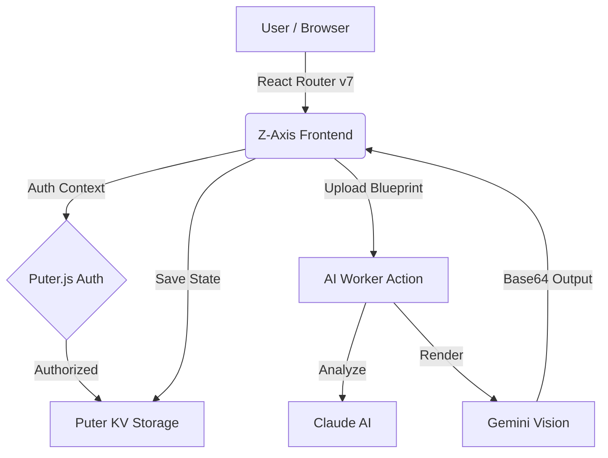
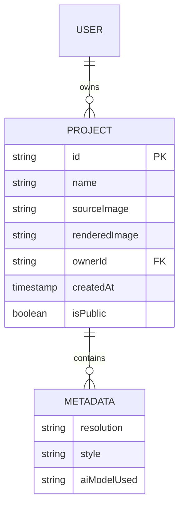

# 🏗️ Z-Axis Cloud
### AI-Powered Architectural Visualization SaaS

**Z-Axis Cloud** is a professional-grade SaaS platform that transforms 2D floor plans into photorealistic 3D architectural renders using multi-model AI orchestration (Claude & Gemini). Built on a serverless, cloud-native architecture, it features persistent metadata storage and a global community showcase.

---

## 🚀 Key Features
* **AI 2D-to-3D Transformation:** Leverages Generative AI to interpret blueprints and output high-fidelity textures and lighting.
* **Glassmorphic Dark UI:** A premium, architectural-focused interface featuring **Instrument Serif** typography.
* **Puter.js Integration:** Cloud-native OS features including permanent hosting and high-performance KV storage.
* **Interactive Before/After:** A side-by-side comparison slider to visualize the AI's structural enhancements.
* **Persistent Metadata:** Architectural "DNA" is saved globally, allowing for persistent project states.

---

## 🛠️ Tech Stack
* **Frontend:** React (Vite), TypeScript, Tailwind CSS 4.0
* **Framework:** React Router v7 (Type-safe routing)
* **AI Models:** Google Gemini (Vision) & Anthropic Claude (Logic)
* **Backend/Cloud:** Puter.js (Serverless, Auth, KV Storage)
* **Icons/UI:** Lucide React, Framer Motion, React Compare Slider

---

## 📐 Project Architecture
The project follows a **Serverless SaaS Architecture**, delegating infrastructure to Puter.js and AI processing to dedicated worker actions.


---
## 🔄 Workflow Diagram

```mermaid
sequenceDiagram
    autonumber
    participant U as User (Architect)
    participant F as Frontend (React)
    participant P as Puter.js (Cloud)
    participant AI as AI Engine (Gemini)

    Note over U, F: User enters Z-Axis Cloud
    U->>F: Upload 2D Floor Plan (Base64)
    F->>P: Check Authentication State
    P-->>F: Auth Confirmed
    F->>P: Initialize Project Metadata
    
    rect rgb(20, 20, 20)
        Note right of F: AI Orchestration Layer
        F->>AI: Send Blueprint & Prompt
        AI->>AI: Deep Vision Analysis
        AI-->>F: Return 3D Rendered Image
    end

    F->>P: Update Project Store (renderedImage)
    F->>U: Render Comparison Slider (Before/After)
    U->>F: Export Final Visualization
```

    
---    
## 🗄️ Database Schema (ER Diagram)
Using Puter’s KV storage, data is structured as JSON objects mapped to unique IDs.

--- 
    
## ⚙️ Installation & Setup
### Clone the Repository:

```bash
git clone [https://github.com/salonyranjan/Z-Axis-Cloud.git](https://github.com/salonyranjan/Z-Axis-Cloud.git)
cd Z-Axis-Cloud
```
### Install Dependencies:

```bash
npm install
```
### Setup Environment:
Create a .env file and add your AI API keys and Puter configuration.

### Run Development Server:
```bash
npm run dev
```